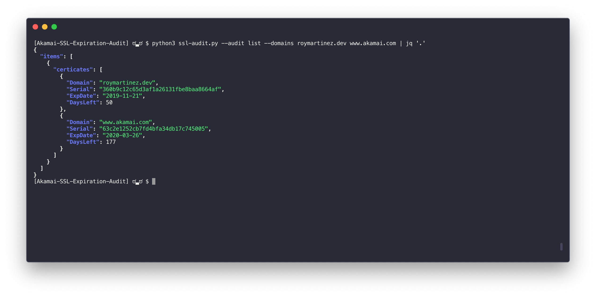
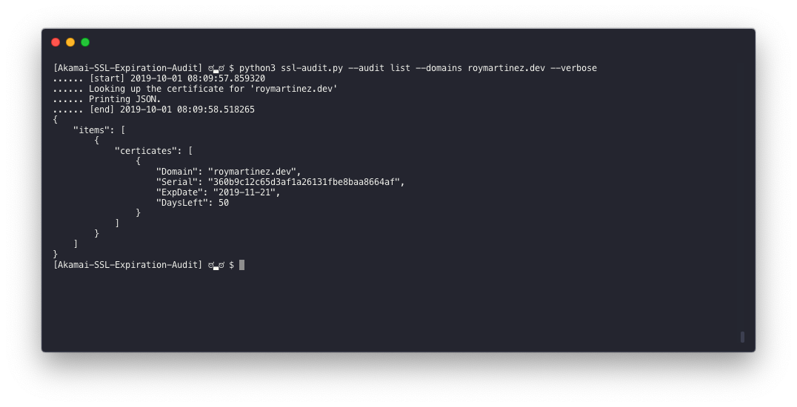

# Akamai SSL Expiration Audit

## What is this?
A tool to audit Akamai Property Manager Configurations (Local and Remote) and DNS Record List for SSL Certificate Expiration dates.

<span style="color:yellow">The goal</span>, behind this project is to provide an easy way to audit  <span style="color:yellow">**audit ssl certificate expiration date**</span>, this is to help us keep an eye over any soon to expire certificate and avoid possible outages due to lack of visibility.

<h1 align="center">
  <br>
      
  <br>
</h1>


## Who is this for?
This project will help mostly Akamai customers but the Audit list functionality will also be of use to any person/company that wants to see when their SSL Certificates might expire. ...(Anyone)


## Features
* Audit Akamai Property Configuration: 
    * Offline JSON Document
    * Current Production version (download latest)
* Audit List of domains
    * List can be provided on a document (comma separated)
    * List can be provided as argument (see "How to use")
* Account-wide Audit
* Switch Key Integration (for multi-account management) 

## Prerequisites/Requirements
I've provided the requirements document to help install all dependencies.

``` pip install -r requirements.txt```

    asn1crypto==0.24.0
    certifi==2019.9.11
    cffi==1.12.3
    chardet==3.0.4
    cryptography==2.7
    decorator==4.4.0
    edgegrid-python==1.1.1
    idna==2.8
    ndg-httpsclient==0.5.1
    pyasn1==0.4.7
    pycparser==2.19
    pyOpenSSL==19.0.0
    python-dateutil==2.8.0
    requests==2.22.0
    six==1.12.0
    urllib3==1.25.6
    validators==0.14.0


## Limitations
Currently, for version 0.1 this script <span style="color:red">**will not look at variables within the origin behaviors**</span> (Property Manager) since this adds a lot of complexity. This is because as an example: a variable (origin) can be made from other variables that are only available in execution time.

## How do I use it?


| Script Arguments        | Required           | Value Type | Description    |
| :---------------------- |:-------------:|:-------------:| :-------------|
| --audit       | * | string | Allowed values: {account,config,file,list}. This field defines the type of audit to used. |
| --domains     | with audit type list. | list | Space delimited list of DNS records.|
| --file        | with audit type "file".  | string | Path to the file to be parsed. |
| --file-type   |   | string | Allowed values: {akamai, list}. You can provide a file that is either a list of DNS records or an Akamai Property Manager JSON configuration. The default value for this argument is "Akamai", meaning if parsing a PM configuration it is optional.|
| --config-name | with audit type "config".  |  list | List of Akamai Property names.|
| --section     |   | string | | name of EdgeRC credential section to be used for Akamai PAPI.
| --account-key |   | string | Akamai account ID to be audited (SwitchKey) |
| --verbose     |   |  None | Print debug information.|

### **Audit** --audit

Defines what and how this script will behave. 
* account: This type of audit will query Akamai using its OPEN API's and will get the list of groups and contracts and for each one it will audit all Property Manager configurations.
* config: Similar to "account" it will fetch the Property Manager configurations but only for the names provided on the "**--config-name**" argument. 
    
    Example: ```--audit config --config-name roymartinez.dev```
* file: Works with **--file-type**. This script currently supports two types of files list and Akamai PM Json (examples provided on the example folder). 

    Example: ```--audit file --file /user/path/roymartinez.dev.json```
* list: Works with **--domains**, it will expect a list of DNS records and get certificate expiration date.

### **Domains** --domains
Space delimited DNS records to be audited.

```--domains roymartinez.dev www.akamai.con```
### **File** --file
Provides path to file to be audited.

```--file /user/path/roymartinez.dev.json```

### **File Type** --file-type
Defines file type that will be used to parse the file, meaning if the value is ```--file-type list``` it will expect a comma separated list within the file and it will loop though them and if it's ```--file-type akamai``` (this is the default value) it will expect a json formated rule tree from Property Manager.

### **Configuration Name** --config-name
This argument is expected when the audit type is **config** because it provides the name of the Akamai Property Manager Configuration to be queries on PAPI.

### **Verbose** --verbose
This enables debug information to be printed on what the script is doing at for visibility.
<h1 align="center">
  <br>
      
  <br>
</h1>

### **Section** --section

Akamai EdgeRC files can have multiple credentials defined by "Sections [default], [papi], etc" the script by default will use the **default** section but this behavior can be change with this argument.,
### **Account Key** --account-key
For multi-account users if you have **switch key** credentials you can specify the account ID with this.

## Examples (use cases)
* <span style="color:orange">**Audit list of domains**</span>

    ```python3 ssl-audit.py --audit list --domains roymartinez.dev```
<h1 align="center">
  <br>
      
  <br>
</h1>

* <span style="color:orange">**Audit list of domains on file**</span>

    ```python3 ssl-audit.py --audit file --file examples/list.txt --file-type list```
<h1 align="center">
  <br>
      
  <br>
</h1>

* <span style="color:orange">**Audit config with section and account ID**</span>

    ```python3 ssl-audit.py --audit config --config-name roymartinez.dev --section allswitch --account-key 1-xyz```
<h1 align="center">
  <br>
      
  <br>
</h1>

## Contribute
Want to contribute? Sure why not! just let me know!

## Author
Me https://roymartinez.dev/
## Licensing
I am providing code and resources in this repository to you under an open-source license. Because this is my repository, the license you receive to my code and resources is from me and not my employer (Akamai).

```
Copyright 2019 Roy Martinez

Creative Commons Attribution 4.0 International License (CC BY 4.0)

http://creativecommons.org/licenses/by/4.0/
```
